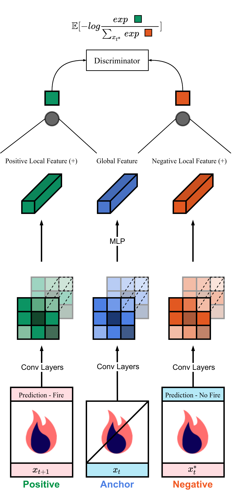

<div align="center">

# 🔥 Detection 🔥
🧠 An Unsupervised Reinforcement Learning Pipeline for Video Frame Classification

| **🚧 This is a Proof of Concept Project 🚧** |
|:--------------------------------------------:|

| **🚧 Authors are not Responsible for Damages to Life and Property if Deployed 🚧** |
|:----------------------------------------------------------------------------------:|

|  |
|:----------------------------------------------------:|
| <b>Fig. 1 -</b> Spatio Temporal Deep InfoMax aka STDIM. It helps us maximize the temporal MI spatially across local feature maps. This is attributed to the existence of the local-local as well the global-local infomax estimations. We also incorporate a spatial prior to incentivize the encoder to focus on all forms of variation. |

</div>



# Motivation 🚀
The algorithm we use is inspired the works of `Anand et. Al.` from 2020 at MILA Labs and Microsoft Research. We repurpose this for video frame classification.

- Inspired by human learning which is largely unsupervised, a state representation learning algorithm learns the high-level features from the image frame neither with labels with explicit rewards nor by modelling the pixels directly. 
- As we work with frames of a video, our data is temporally consistent. Additionally, local consistency is also observed as some objects don’t move drastically over time. We exploit these structures to learn the representations directly. 

# Further Explanation 🧐

**Fig. 2 -** _(right)_ shows the contrastive task of learning the final discriminator. We use a bilinear model for calculation of the score function based on the output from the representation encoder below. The objective function of the discriminator assigns large values to positive examples and small values to negative examples by maximizing the given bound in the top equation. 

This translates into maximizing the true positives while minimizing the mis predictions and false alarms.

# Usage 👨‍💻
Get the dataset from [here](https://drive.google.com/drive/folders/1HznoBFEd6yjaLFlSmkUGARwCUzzG4whq?usp=sharing) and 
place it under datasets. 
```shell
python runner.py --arch [cnn, dqn, usrl]
```
The trained weights will be stored in the root of the runner script. 

## Inference
```shell
python test.py
```

# Todo 📜
- [x] CNN
- [x] RL - DQN
- [x] RL - USRL
- [x] Live cam test script

# References 📑

- [Creating a custom gym env](https://towardsdatascience.com/creating-a-custom-openai-gym-environment-for-stock-trading-be532be3910e)
- [Boilerplate for trainer scripts](https://github.com/pytorch/examples/blob/master/mnist/main.py)
- [DQN Implementation](https://github.com/Syzygianinfern0/Stable-Baselines)
- [Unsupervised State Representation Learning](https://github.com/mila-iqia/atari-representation-learning)
- [Project Inspiration](https://github.com/arpit-jadon/FireNet-LightWeight-Network-for-Fire-Detection)

```bibtex
@article{anand2019unsupervised,
  title={Unsupervised State Representation Learning in Atari},
  author={Anand, Ankesh and Racah, Evan and Ozair, Sherjil and Bengio, Yoshua and Cot'e, Marc-Alexandre and Hjelm, R Devon},
  journal={arXiv preprint arXiv:1906.08226},
  year={2019}
}
```
